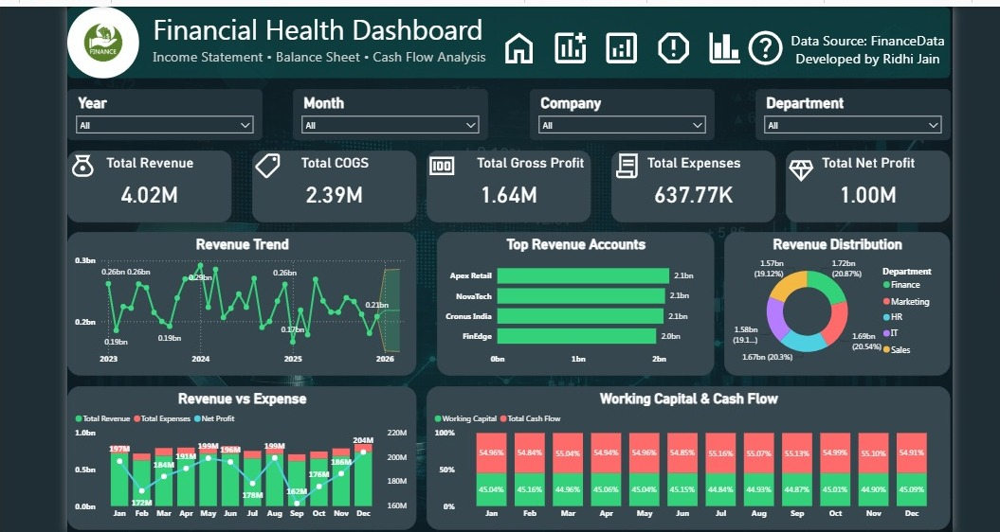

# Financial Health Dashboard

## Overview

This project presents an interactive Financial Health Dashboard developed using Microsoft Power BI. It provides a comprehensive overview of an organization's financial performance through key financial indicators, profitability trends, cash flow analysis, and forecasting. The dashboard helps businesses monitor financial health and make informed budgeting decisions.

---

## Objectives

- Analyze financial performance using interactive visualizations.
- Track Revenue, COGS, Gross Profit, Expenses, and Net Profit.
- Monitor Working Capital and Cash Flow.
- Analyze profitability trends over time.
- Forecast future revenue for budgeting and financial planning.

---

## Dashboard Features

### KPI Cards
- Total Revenue
- Total COGS
- Total Gross Profit
- Total Expenses
- Total Net Profit

### Interactive Filters
- Year
- Month
- Company
- Department

### Visualizations
- Revenue Trend with Forecast
- Top Revenue Accounts
- Revenue Distribution
- Revenue vs Expenses
- Working Capital & Cash Flow Analysis

---

##  Tools Used

- Microsoft Power BI
- Power Query
- DAX
- Microsoft Excel

---

##  Dataset

The dashboard uses a finance dataset containing:

- Revenue
- COGS
- Gross Profit
- Expenses
- Net Profit
- Cash Flow
- Working Capital
- Company
- Department
- Date

---

## Dashboard Preview

### Dashboard

---

##  Key Insights

- Revenue and profitability can be monitored across multiple years.
- Revenue forecasting supports financial planning.
- Working Capital and Cash Flow provide operational health insights.
- Department-wise revenue distribution helps identify top-performing business units.
- Interactive filters enable dynamic business analysis.

---

##  Future Improvements

- Budget vs Actual Analysis
- Regional Financial Comparison
- Profit Margin Analysis
- Financial Ratio Dashboard
- Executive Summary Page

---

## Developed By

**Ridhi Jain**

Microsoft Power BI Project
